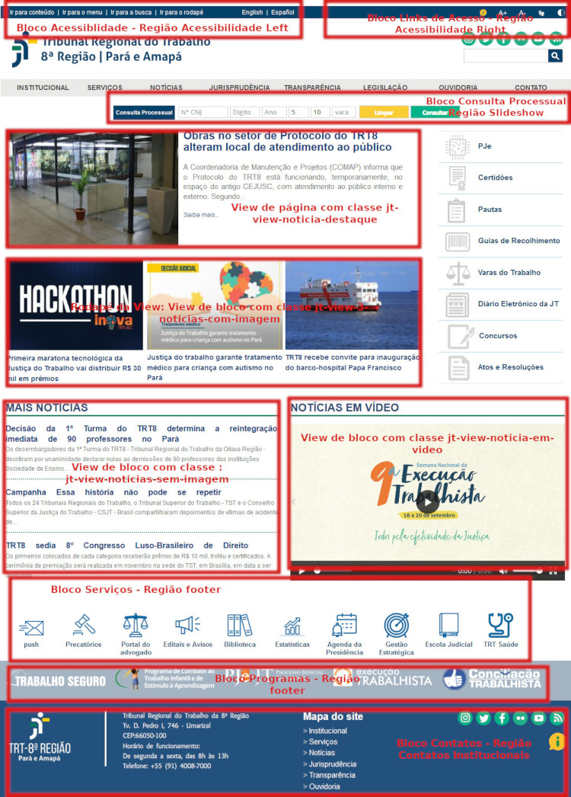

# Tema para Nova Identidade da Justiça do Trabalho

## Cabeçalho da View
## Região Acessibilidade Left

### Bloco Acessibilidade
    

        <ul>
            <li><a href="#">Ir para conteúdo </a></li>
            <li>|</li>
            <li><a href="#">Ir para o menu </a></li>
            <li>|</li>
            <li><a href="#">Ir para a busca </a></li>
            <li>|</li>
            <li><a href="#"> Ir para o rodapé</a></li>
        </ul>
    

    

        <ul>
            <li><a href="#">English</a></li>
            <li>|</li>
            <li><a href="#"> Español</a></li>
        </ul>
    

## Região Acessibilidade Right

### Bloco Links de Acesso
    

        <ul>
            <li>
                
            </li>
            <li>
                
            </li>
            <li>
                
            </li>
            <li>
                
            </li>
            <li>
                
            </li>
        </ul>
    

## Região Slideshow

### Bloco Consuta processual
    

        
Consulta Processual

        

            <input type="text" class="border_input" name="numero" id="numero" placeholder="N° CNJ" />
            <input type="text" class="border_input" name="digito" id="digito" placeholder="Digito" />
            <input type="text" class="border_input" name="ano" id="ano" placeholder="Ano" />
            <input type="text" class="border_input" name="justica" id="justica" value="5" />
            <input type="text" class="border_input" name="regiao" id="regiao" value="10" />
            <input type="text" class="border_input" name="vara" id="vara" placeholder="vara" />
            

                <button class=" buttom_consultation clean">Limpar</button>
                <button class="buttom_consultation consult">Consultar</button>
            

        

    

## Região Rodapé
    
### Bloco: Serviços
    

        

            <ul>
                <li class="servico">
                    <a href="#">
                        

                        

                            <h4>push</h4>
                        

                    </a>
                </li>
                <li class="servico">
                    <a href="#">
                        

                        

                            <h4>Precatórios</h4>
                        

                    </a>
                </li>
                <li class="servico">
                    <a href="#">
                        

                        

                            <h4>Portal do advogado</h4>
                        

                    </a>
                </li>
                <li class="servico">
                    <a href="#">
                        

                        

                            <h4>Editais e Avisos</h4>
                        

                    </a>
                </li>
                <li class="servico">
                    <a href="#">
                        

                        

                            <h4>Biblioteca</h4>
                        

                    </a>
                </li>
                <li class="servico">
                    <a href="#">
                        

                        

                            <h4>Estatísticas</h4>
                        

                    </a>
                </li>
                <li class="servico">
                    <a href="#">
                        

                        

                            <h4>Agenda da Presidência</h4>
                        

                    </a>
                </li>
    
                <li class="servico">
                    <a href="#">
                        

                        

                            <h4>Gestão Estratégica</h4>
                        

                    </a>
                </li>
                <li class="servico">
                    <a href="#">
                        

                        

                            <h4>Escola Judicial</h4>
                        

                    </a>
                </li>
                <li class="servico ultimo_servico">
                    <a href="#">
                        

                        

                            <h4>TRT Saúde</h4>
                        

                    </a>
                </li>
            </ul>
        

    

    

### Bloco: Programas
    

        

            <ul class="lista_banner">
                <li class="item_banner">
                    
                </li>
                <li class="item_banner">
                    
                </li>
                <li class="item_banner">
                    
                </li>
                <li class="item_banner">
                    
                </li>
                <li class="item_banner">
                    
                </li>
            </ul>
        

    

## Região Contatos Institucionais

### Bloco: Contatos

    

            

                

                    
                

                

                    
Tribunal Regional do Trabalho da 8ª Região

                    
Tv. D. Pedro I, 746 - Umarizal

                    
CEP:66050-100

                    
Horário de funcionamento:   De segunda a sexta, das 8h às 13h

                    
Telefone: +55 (91) 4008-7000

                

                

                    <h2>Mapa do site</h2>
                    <ul>
                        <li><a href="#">>Institucional</a></li>
                        <li><a href="#">>Serviços</a></li>
                        <li><a href="#">>Notícias</a></li>
                        <li><a href="#">>Jurisprudência</a></li>
                        <li><a href="#">>Transparência</a></li>
                        <li><a href="#">>Ouvidoria</a></li>
                    </ul>
                

                

                    <ul class="lista_links">
                        <li>
                            <a title="Instagram do TRT8" href="https://www.instagram.com/trt_8a/" target="_blank" rel="me">
                                

                            </a>
                        </li>
                        <li>
                            <a title="Twitter do TRT8" href="https://www.twitter.com/trt8_oficial" target="_blank">
                                

                            </a>
                        </li>
                        <li>
                           <a title="Facebook do TRT8" href="https://www.facebook.com/trt8Regiao" target="_blank" >
                                

                            </a>
                        </li>
                        <li>
                            <a title="Flickr do TRT8" href="https://www.flickr.com/photos/trt8_oficial/"  target="_blank" >
                                

                            </a>
                        </li>
                        <li>
                            <a title="Youtube do TRT8" href="https://www.youtube.com/user/trt8videos/videos" target="_blank" >
                                

                            </a>
                        </li>
                       <li>
                            <a title="RSS das notícias do TRT8" href="/rss.xml" target="_blank">
                                

                            </a>
                        </li>
                    </ul>
                    

                        
                    

                

            

        

