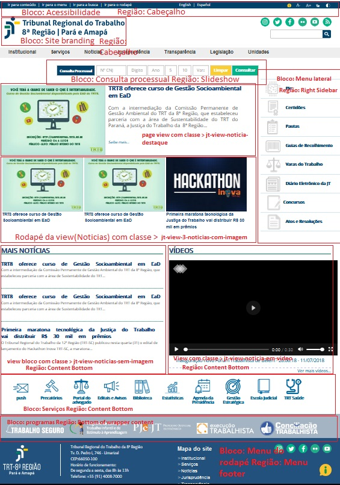

# Tema para Nova Identidade da Justiça do Trabalho

### Cabeçalho
	

	   

		  <ul>
			 <li><a href="#">Ir para conteúdo </a></li>
			 <li>|</li>
			 <li><a href="#">Ir para o menu </a></li>
			 <li>|</li>
			 <li><a href="#">Ir para a busca </a></li>
			 <li>|</li>
			 <li><a href="#">Ir para o rodapé</a></li>
		  </ul>
	   

	   

		  <ul>
			 <li><a href="#">English</a></li>
			 <li>|</li>
			 <li><a href="#">Español</a></li>
		  </ul>
	   

	   

		  <ul>
			 <li class="icons_access_links icons_information">&nbsp;</li>
			 <li class="icons_access_links icons_zoom_more">&nbsp;</li>
			 <li class="icons_access_links icons_zoom_less">&nbsp;</li>
			 <li class="icons_access_links icons_libras">&nbsp;</li>
			 <li class="icons_access_links icons_contrast">&nbsp;</li>
			 <li class="icons_intranet">&nbsp;</li>
		  </ul>
	   

	

	
### Search & Redes Sociais
SEARCH : O Search deve ser alocado na região 'Busca'

REDES SOCIAIS: Você pode encontrar o HTML no arquivo 'page.html.twig'; seus icons estão no css como background
	
### Consulta Processual
	

	   

		  <form class="form-inline">
			 <button class="btn consulta_processual_badge" id="consulta_processual_badge" type="button">Consulta Processual</button>
			 
<label class="sr-only" for="numero_cnj">Nº CNJ</label> <input class="form-control" id="numero_cnj" placeholder="Nº CNJ" type="text" />

			 
<label class="sr-only" for="digito">Digito</label> <input class="form-control" id="digito" placeholder="Digito" type="text" />

			 
<label class="sr-only" for="ano">Ano</label> <input class="form-control" id="ano" placeholder="Ano" type="text" />

			 
<label class="sr-only" for="justica">Justiça</label> <input class="form-control" id="justica" placeholder="5" type="text" />

			 
<label class="sr-only" for="regiao">Região</label> <input class="form-control" id="regiao" placeholder="10" type="text" />

			 
<label class="sr-only" for="vara">Vara</label> <input class="form-control" id="vara" placeholder="Vara" type="text" />

			 <button class="btn mb-2 consulta_processual_clean" type="submit">Limpar</button><button class="btn mb-2 consulta_processual_consult" type="submit">Consultar</button>
		  </form>
	   

	

### Menu Lateral
	

		

			

				<ul>
					<li class="menu_right_pje"><a href="#">PJe</a></li>
					<li class="menu_right_certidoes"><a href="#">Certidões</a></li>
					<li class="menu_right_pautas"><a href="#">Pautas</a></li>
					<li class="menu_right_recolhimento"><a href="#">Guias de Recolhimento</a></li>
					<li class="menu_right_varas"><a href="#">Varas do Trabalho</a></li>
					<li class="menu_right_diario"><a href="#">Diário Eletrônico da JT</a></li>
					<li class="menu_right_concursos"><a href="#">Concursos</a></li>
					<li class="menu_right_resolucoes"><a href="#">Atos e Resoluções</a></li>
				</ul>
			

		

	

### Rodapé
	

<a href="#">/themes/jt_2019_d8_trt8/images/logo_footer.png" /></a>

Tribunal Regional do Trabalho da 8ª Região

Tv. D. Pedro I, 746 - Umarizal

CEP:66050-100

Horário de funcionamento: 
De segunda a sexta, das 8h às 13h

Telefone: +55 (91) 4008-7000

<h2>Mapa do site</h2>

<ul>
	<li><a href="#">&gt;Institucional</a></li>
	<li><a href="#">&gt;Serviços</a></li>
	<li><a href="#">&gt;Notícias</a></li>
	<li><a href="#">&gt;Jurisprudência</a></li>
	<li><a href="#">&gt;Transparência</a></li>
	<li><a href="#">&gt;Ouvidoria</a></li>
</ul>

<ul class="lista_links">
	<li>
	
&nbsp;

	</li>
	<li>
	
&nbsp;

	</li>
	<li>
	
&nbsp;

	</li>
	<li>
	
&nbsp;

	</li>
	<li>
	
&nbsp;

	</li>
</ul>

<a href="#">/themes/jt_2019_d8_trt8/images/icon_exclamacao.png" /></a>

